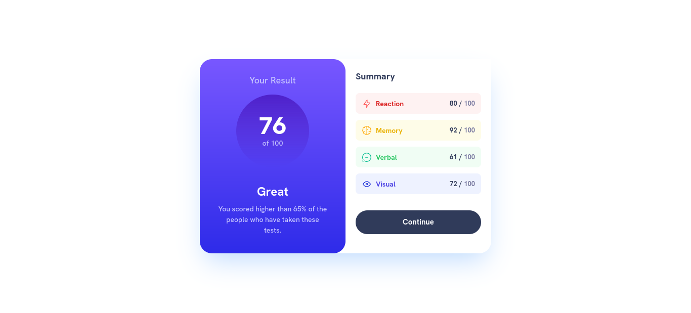

# Frontend Mentor - Results summary component solution

This is a solution to the [Results summary component challenge on Frontend Mentor](https://www.frontendmentor.io/challenges/results-summary-component-CE_K6s0maV). Frontend Mentor challenges help you improve your coding skills by building realistic projects. 

## Overview
Foi mais um Projecto Desafiador para Aprimorar minhas Capacidades como Desenvolvedor Fronted, aprendi a usar o axios e pude usar Programação Assícrona, foi Bom também usar o Grid de Tailwind CSS para Terminar o Projecto
### The challenge

Users should be able to:

- View the optimal layout for the interface depending on their device's screen size
- See hover and focus states for all interactive elements on the page

### Screenshot

### Links

- Solution URL: [Add solution URL here](https://your-solution-url.com)
- Live Site URL: [Add live site URL here](https://your-live-site-url.com)

### Built with

- Semantic HTML5 markup
- CSS custom properties
- Flexbox
- CSS Grid
- Tailwind CSS

## Author

- Frontend Mentor - [@mariosalembe23](https://www.frontendmentor.io/profile/mariosalembe23)
- Twitter - [@mariosalembe010](https://www.twitter.com/MarioSalembe010)

